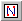

.. _Network_Creating_a_New_Network_Object:

Create a Network Object
=======================

To create a network object:

1.	While in Edit Mode, select |img_def_Network_Object_button_bmp| Network from the Object menu.

2.	On the page, drag a rectangle where you want the network object to appear.

The Network Object dialog box appears. You now have the option of specifying several nodes and arcs to appear in your network.

To Add a node:

3.	Choose <New> in the Nodes box.

4.	At Node Set, specify indices that represent the nodes you want to appear in your network.

5.	At X Coordinate, specify a parameter which represents the x-coordinate of the nodes.

6.	At Y Coordinate, specify a parameter that represents the y-coordinate of the nodes.

7.	Click Add in the Node box.

8.	Repeat 3 through 6 for all nodes you want to add to your network.

Now you have the option of specifying the arcs that represent the flow in your network object.

To add an arc:

9.	Choose <New> in the Arcs box.

10.	At Arcs, specify an identifier that is indexed over the sets that are used as nodes that represents the amount of flow.

11.	Click Add in the Arcs box.

12.	Repeat 9 through 11 for all the arcs you want to add to your network.

13.	Click Ok.

**Note** 

*	The arc identifier should at least have two indices that match with two of the node sets. For every non-default tuple of the arc identifier a line is drawn between the two referred nodes. If the arc identifier has more than two free indices, then this may result in multiple lines between the same two nodes.
*	AIMMS draws straight arc lines between nodes by default, so if there are multiple arcs between two nodes, then you will not be able to see them separately. You can use curved or segmented lines to avoid this situation. See :ref:`Network_Network_Object_Properties_-_Ar` 

