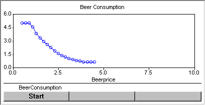

.. _Parametric-Curve_Parametric_Curve_Introduction:

Parametric Curve Introduction
==============================

.. note:: **Evolution:** Since AIMMS 4.88 no longer available, see `Parametric Curve no longer available release note <https://documentation.aimms.com/release-notes.html#id222>`_

**Description** 

A parametric curve displays a line graph showing the interdependency between two identifiers. Stated simply, it displays the independent variable on the X-axis, and dependent variables on the Y-axis. You must enter a range for the X-axis identifier and a number of steps. AIMMS divides the range into this number of equal-sized intervals. Then, AIMMS updates the values of the X-axis identifier and displays the resulting values for the Y-axis identifiers for each X-value. You can specify which procedure should be used to calculate the Y-axis values.

The parametric curve is equipped with buttons. By clicking the Start button the calculation of the y identifiers will start. You can press Pause to temporarily stop calculation, after which you can press Continue to continue calculation. By clicking the Stop button, the calculation will stop and can not be continued.

An example of a parametric curve is shown below.

|img_def_Parametric_Curve_example_BMP|

**Note** 

*	The Parametric Curve provides a quick and easy way to see how the changing one single scalar identifier has an effect on another scalar or one-dimensional identifier. If you need to do more complicated experiments, then you can always write specific procedures in which you run a procedure multiple times for multiple inputs, and store the results in (indexed) identifiers that, in turn, can be displayed on a page.

**How to …** 

*	:ref:`Parametric-Curve_Creating_a_Parametric_Curve`  
*	:ref:`Parametric-Curve_Parametric_Curve_Properties_-1`  

**Learn more about** 

*	:ref:`Parametric-Curve_Parametric_Curve_Properties`  

