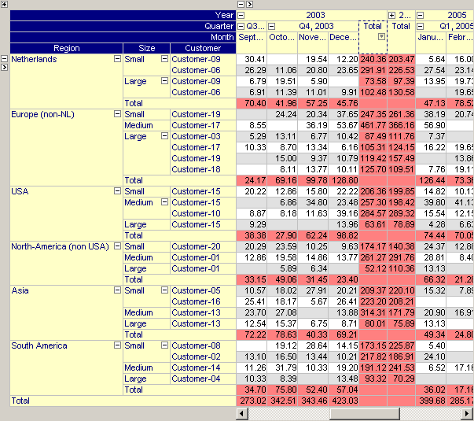
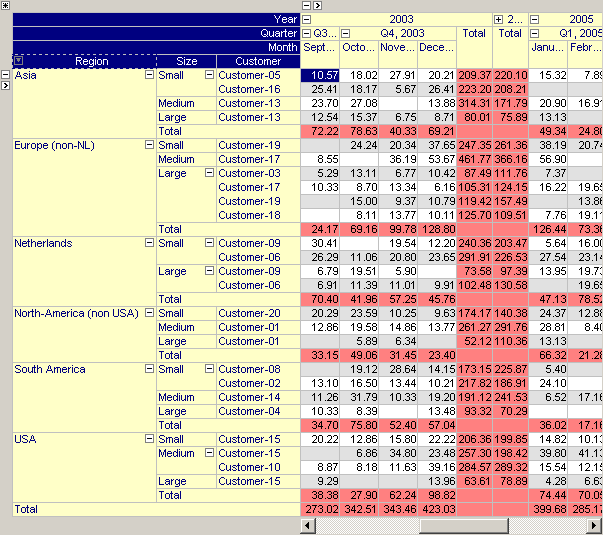
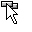
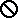

.. _Pivot-Table_ElementOrdering:

Sorting
=======

**Value Based Sorting** 

To sort all elements in a row or column, based on their value in the grid area, select a leaf element in the row or column tree and press the small sort button |img_def_Button_-_Sort_-_3_8_jpg|. Note that the elements in the selected column will not be globally sorted. Instead, this operation will only change the order of elements (in the opposite tree) as long as they share the same parent. For example, in the picture below, pressing the small sort button resulted in a reordering of all customers (for a given region and given size) such that the total sales in 2003 is increasing.

|img_def_End-User_Controled_Layout_-_Column_Sorting_png|

Grid values are sorted depending on their type. For numerical values a straight-forward numerical comparison criterion is used. Element values are sorted following the set ordering as defined in the model, and string values are sorted using a (case-insensitive) string comparison. 

Pressing the sort button repetitively 

*   will toggle between an increasing numerical order (|img_def_Button_-_Sort_-_Up_jpg|), the set order of the leaf elements in the row tree (|img_def_Button_-_Sort_-_3_8_jpg|) and a decreasing numerical order (|img_def_Button_-_Sort_-_Down_jpg|) for numerical identifiers,
*   will toggle between an increasing alphabetically order (|img_def_Button_-_Sort_-_Up_jpg|), the set order of the elements (|img_def_Button_-_Sort_-_3_8_jpg|) and a decreasing alphabetically order (|img_def_Button_-_Sort_-_Down_jpg|) for element valued identifiers, and
*   will toggle between an increasing alphabetically order (|img_def_Button_-_Sort_-_Up_jpg|), the set order of the leaf elements in the row tree (|img_def_Button_-_Sort_-_3_8_jpg|) and a decreasing alphabetically order (|img_def_Button_-_Sort_-_Down_jpg|) for string valued and unit valued identifiers.

**Nested Sorting** 

When you sort the pivot table with respect to a certain row and column you refine this sort by pressing the sort button for some other row or column while keeping the ``<Shift>``  key pressed. Doing so, will sort the pivot table on multiple criteria. When after sorting according to the first sort criterion, two values are equal, these values will be sorted according to the second. This process is continued for all sort criterions that have been specified while keeping the ``<Shift>``  key pressed. As soon as the user selects a new sort criterion without keeping the ``<Shift>``  key pressed or as soon as the user specifies a sort criterion in the other tree or in one of the headers of the pivot table (see below), the list of sort criterions is reset.

**Element Based Sorting** 

When selecting a header a sort button |img_def_Button_-_Sort_-_Header_jpg| will appear in the header. Pressing this sort button will reorder the elements in the corresponding tree such that all elements corresponding to the selected header (which have the same parent node) will be sorted alphabetically. For example, in the picture below pressing the small sort button in the region header will sort all regions alphabetically.

|img_def_End-User_Controled_Layout_-_Tree_Sorting_png|

Pressing the sort button repetitively will toggle between an increasing alphabetical order (|img_def_Button_-_Sort_-_Header_-_Up_png|), the original set order (|img_def_Button_-_Sort_-_Header_jpg|) and a decreasing alphabetical order (|img_def_Button_-_Sort_-_Header_-_Down_jpg|).

**Element Drag and Drop** 

The end-user is also able to change the order of elements in the row and column tree (as long as they share the same parent) by drag and drop. When the end-user picks up an element the cursor will change into |img_def_Mouse_Pointer_-_sort_tree_png|. During dragging the mouse cursor will indicate when it is not possible to drop the selected element (by changing the cursor into |img_def_Mouse_Pointer_-_not_allowed_jpg|).

