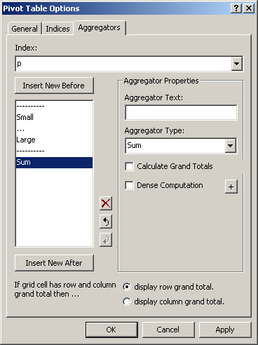
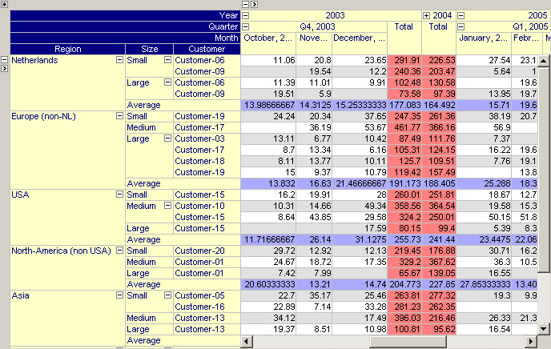

.. |img_def_Button_-_user_options_jpg| image:: images/Button_-_user_options.jpg

.. _Pivot-Table_End-UserDialog:

End-User Dialog
===============

By clicking on the Properties button |img_def_Button_-_user_options_jpg| of a pivot table, the end-user options dialog will appear. In this dialog, an end-user can modify the following settings.

**General Tab** 

On the General tab you can modify various global settings of the pivot table. Which of these modifications are available to the end-user is determined by the developer through the properties on the :ref:`Pivot-Table_General2`  tab of the Properties dialog box.

|img_def_End_User_Dialog_-_General_Tab_png|

*   Multiple Case Object. This option can be used to make the pivot table into a multiple case object. To achieve this, an extra dimension (i.e. a case index) is added to the pivot table. Multiple cases are specified from within the Data-Multiple Case menu command.

*   Show Subheaders. This option is only relevant for pivot tables that contain more than one identifier. Subheaders are drawn on level below the level of the 'Identifier' index. To save some extra rows or columns or when the identifiers in the pivot table have identical index domains you may want to remove the subheaders from the pivot table. 

*   Only Show Rows/Columns with Differences. This option allows you to compare data quickly. All rows or columns with identical values are filtered from the pivot table. When you make the pivot table a multiple case object, make the case index the only index in the column area and when you only show rows with differences, the pivot table becomes a convenient graphical tool to compare case data. 

*   First Index Always Dense. With this option you make sure that the first index in the row (or column) area will always show all available elements. This option overrules the setting on the Indices tab for the current first index. This option makes it easy to display a dense one- or two-dimensional table which is especially convenient for data entry. Please note that this option is automatically set if the Pivot Table is used on a Data Page for an updatable identifier.

*   Reset Column Widths. When the pivot table is initialized (and no column width information has been stored in the state), the column width are initialized to make sure that all cell values and header texts are fully visible. After manual data entry or column resizing not all values might be visible again (or some columns might be unnecessarily wide). By pressing the 'Reset Column Widths' button, all column width will be re-initialized to their minimum required width. Note that the column widths can also be controlled by specifying a 'Column Width' identifier on the Indices tab.

*   Include Header Width. With this option you can decide whether the width of the header texts should also be considered in determining the minimal required header width (when pressing the 'Reset Column Widths' button). 

**Indices Tab** 

On the Indices tab, you can specify for every index whether or not you want to view its data sparse or dense. When all indices are viewed sparse the pivot table will contain no empty rows or columns. When you want to use the pivot table for data entry or when some indices are naturally ordered (e.g. time indices), it might be convenient to view some indices dense. 

When using multiple dense indices you must be carefull not to create too large Pivot Tables. For example, if you have three indices in your table and each index has 100 elements, then dragging all indices to the row area results in a table with 1 million (!) rows, which will have a bad effect on the performance of the Pivot Table.

|img_def_End_User_Dialog_-_Indices_Tab_png|

**Aggregators** 

On the Aggregators tab you can specify the aggregator(s) associated with each index. Every aggregator calculates a single value over the elements specified by the index. The deeper the index occurs in the tree structure the more values will be computed but the less cell values are taken into account during the computation of this value. In the figure below, you see a 'Sum' aggregator being placed after the elements associated with the 'Size' index. 

|img_def_End_User_Dialog_-_Aggregators_Tab_png|

For every aggregator you can specify

*   the Aggregator Text displayed in the pivot table for the aggregator at hand. If you do not specify an aggregator text, AIMMS will take the name of the aggregator type as the default text to display.

*   the Aggregator Type for the type of aggegration to perform. The following aggregation types are available:

*   Sum: display the sum of all aggregated values
*   Average: display the average of all aggregated values
*   Min: display the minimum of all aggregated values
*   Max: display the maximum of all aggregated values
*   Difference: display the difference of exactly two aggregated values. If there are more than two values available the difference will remain empty.
*   Range: display Max - Min of all aggregated values, if there are at least two aggregated values. Note that this aggregation is always positive.
*   Count: display the number of aggregated values

*   whether or not to display grand totals. By checking the Calculate Grand Totals checkbox, grand totals will be computed for grid cells that correspond to a row aggregator and a column aggregator. The displayed grand total value is computed by applying the aggregator operation (sum, minimum, etc.) to the values of the opposite aggregator.

*   whether or not you want the aggregation to be a Dense Computation. By default, AIMMS will perform the aggregation over all non-default values only. By checking Dense Computation AIMMS will perform the aggregation over the associated domain in a dense manner.

*   whether or not you want to create a compound aggregator by specifying a sequence of simple aggregators. You can achieve this by pushing the + button. Compound Aggregators are explained below in detail.

When a grid cell is associated with both a row aggregator and a column aggregator and for both aggregators the Calcualte Grand Totals checkbox has been checked, the global option If grid cell has row and column grand total then ... at the bottom of the Aggregators tab can be used to specify a preference to control whether you want to see the row or column grand totals. Note that if both aggregators have Aggregator Type Sum, Average, Min or Max this option will not affect the result.

**Remark** 

 

Note that applying a dense aggregator to a sparse index, or a sparse aggregator to a dense index, may lead to apparently incorrect results. Also applying a dense aggregator to an identifier with a nonzero default, where the display does not show the defaults, will lead to apparently incorrect results.

**Example** 

 

The figure below illustrates the pivot table with the aggregator specified above in place.

|img_def_Figure_9_-_aggregator_1_png|

By dragging the 'Size' index to the left, you can see in the figure below that the aggregator will automatically adapt itself to sum over size but also over customers.

|img_def_Figure_9_-_aggregator_2_png|

By dragging the 'Size' index even more to the left, the aggregation will take place over the entire row domain, as illustrated in the figure below.

|img_def_Figure_9_-_aggregator_3_png|

**Grand Totals** 

The pivot tables in the two figures below have been extended to display grand totals. In the first pivot table, the column aggregator is used to compute the grand total (i.e. the red numbers indicate the totals per year) while in the second pivot table, the same data is shown but instead the row aggregator is used to compute the grand total (i.e. the average per region). Note that the aggregator background color has been used to indicate whether the grand total is computed based on the column or row aggregator.

|img_def_End-User_Controled_Layout_-_Grand_Totals_Columnwise_png|

The same pivot table but with row grand totals being preferred over column grand totals.

|img_def_End-User_Controled_Layout_-_Grand_Totals_Rowwise_png|

**Compound Aggregators** 

By checking the + button on the Aggregators tab, you can create a compound aggregator, specified as a list of aggregators. A compound aggregator will apply the first aggregator to values resulting from the second aggregator applied to the values associated with the index level directly below the index for which the compound aggregator was specified.

|img_def_End_User_Dialog_-_Aggregators_Tab_-_Compound_png|

In the figure above, a compound aggregator Average - Sum is created, representing the average of quarterly totals. The result of this compound aggregation is displayed in the figure below. 

|img_def_Figure_8_-_compound_aggregator_png|

