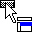
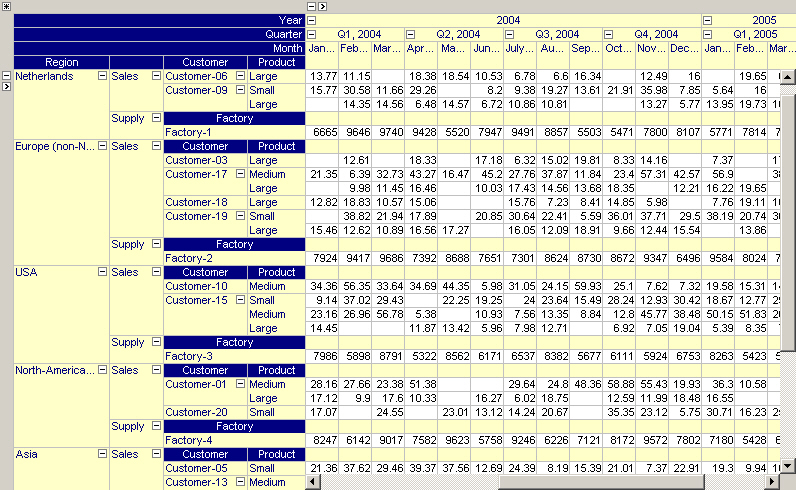

.. |img_def_Mouse_Pointer_-_not_allowed_jpg| image:: images/Mouse_Pointer_-_not_allowed.jpg

.. _Pivot-Table_HeaderDragandDrop:

Header Drag and Drop
====================

In end-user mode you can control the layout of the pivot table by dragging and dropping the headers around. The headers can be dragged around between the row area, the column area and the outer indices area. The mouse cursor will change to indicate the area on which the header is about to be dropped (|img_def_Mouse_Pointer_-_row_area_jpg|, |img_def_Mouse_Pointer_-_column_area_jpg| and |img_def_Mouse_Pointer_-_outer_indices_area_jpg| respectively). When a certain movement is not allowed the cursor will change to |img_def_Mouse_Pointer_-_not_allowed_jpg|. To move a header to the left of some other header (in the row tree) it can be dropped in the left half of the header that should appear on the right of the moved header or in the right half of the header that should appear on the left of the moved header. Similarly, to move a header above some other header (in the column tree) it can be dropped in the upper half of the header that should appear below the moved header or in the lower half of the header that should appear above the moved header.

To understand why a certain movement is not allowed it is necessary to understand the difference between common and uncommon headers. Common headers are headers that correspond to indices present in the index domain of all identifiers in the pivot table. The special 'Identifier' and 'Case' are also common headers. All other indices are referred to as uncommon indices. Note that all indices are common when the pivot table only displays a single identifier.

The figure shows a pivot table with two identifiers, a 6-dimensional 'Sales' identifiers with index domain (customer, region, product, year, quarter,month) and a 5-dimensional 'Supply' identifier with index domain (factory, region, year, quarter, month). The 'customer', 'product' and 'factory' headers are the uncommon headers and appear as so-called subheaders in the pivot table.

|img_def_Figure_7_-_multiple_identifiers_png|

A common index may be positioned anywhere, while a uncommon index may only be 

*	placed underneath the 'Identifier' index, or
*	used as an outer index. 

Whenever you drag the 'Identifier' header from the row area to the column area (or vice versa), all uncommon indices will be dragged along with the 'Identifier' header.

