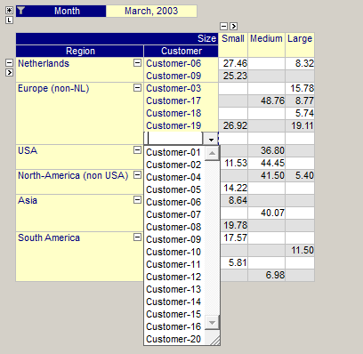

.. _Pivot-Table_PivotTable-InsertDelete:

Insert or Delete a Row/Column
=============================

When an index is only showing sparse data, then those elements for which no data currently exists, are not shown in the table. This makes it impossible to specify new data for such an element. To allow you to add data for such an element you can either set the index to 'Dense' or you can manually insert 'missing' elements anywhere in the row- or column tree.

To do this you click at a specific location in either the row- or column area and then press the Insert key. The table will then present you with a list of elements that are currently not shown and you can pick the element that you want to insert (if only one element is available it will be inserted automatically). In this way you can add a new (empty) row or column in your table for which you can start entering values.

In the figure below you see the result of pressing the Insert key while the focus is on element "Customer-19". The drop-down list allows you to pick any of the customers that are currently not shown for the region "Europe (non-NL)".

|img_def_PivotTable-ManuallyInsertDelete_png|

In a similar way you can also delete entire rows and columns from your table. Simply click on the specific element in either the row or column area and then press the Delete key. This delete action does not delete any data in the underlying identifier, it only adjusts your current view on the data. To re-insert the deleted row or column, you use the Insert key as described above.

Please note that manually inserting and deleting rows using the Insert and Delete key results in a temporary view of the table. As soon as the table redraws itself due to to underlying data changes or pivoting actions these modifications to the view may get lost. Therefore, when creating a new empty row or column using the Insert key, you should start entering the values for the row and column before performing any other action that may again delete that row or column. 

