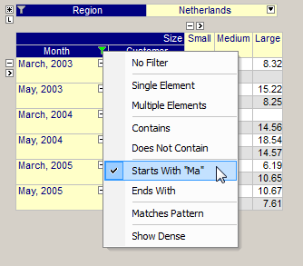

.. _Pivot-Table_PivotTable_Index_Filtering:

Index Filtering
===============

On each index in the pivot table, you can apply a (temporary) filter such that only a subset of the elements are displayed. 

In the figure below you see the effect of applying a "Starts With" filter on the index Month:

|img_def_PivotTable-IndexFiltering_png|

When you click in any of the index headers in the table, the filter icon |img_def_InactiveFilter_png| is displayed. Clicking the icon reveals a popup menu in which you can enable or remove a specific filter.

As you can see in the figure, there are several types of filters available:

*   The 'Single Element' and 'Multiple Elements' filters let you easily pick one (or more) specific element(s) for the given index.
*   For the 'Contains', 'Not Contains', 'Starts With' and 'Ends With' filters you can specify a string which is matched against the names of the available elements.
*   The 'Matches Pattern' filter allows you to specify a string containing one or more wildcard characters (either '?' or '*'). The '?' matches a single arbitrary character, while the '*' character matches a sequence of zero or more arbitrary characters.

Whenever a filter is active for an index, the green filter icon |img_def_ActiveFilter_png| is visible to help you remember that you are looking at only a subset of the data. To remove a filter, simply select the 'No Filter' action from the popup menu.

For convenience, the popup menu also has a 'Show Dense' command. This is a shortcut to the functionality that is also offered in the Indices tab of the :ref:`Pivot-Table_End-UserDialog` .

