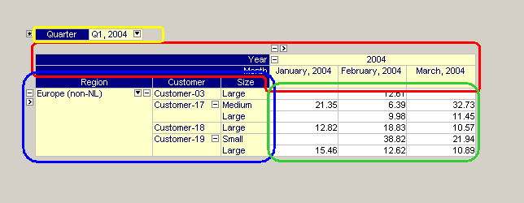

.. _Pivot-Table_AreasofthePivotTable:

Areas of the Pivot Table
========================

The pivot table view can be divided into four main areas, as illustrated in the picture below:

|img_def_Figure_5_-_pivot_table_areas_png|

The following areas can be distinguished.

**Row Area and Header** 

The row area is the area of the pivot table that consist of the row headers (the row indices) and the elements that are structured in a tree-wise manner. Standard tree operations allow you to open (and close) levels in this tree. 

In the figure above the row area is indicated by the blue rectangle.

**Column Area and Header** 

The column area is the area of the pivot table that consist of the column headers (the column indices) and the elements that are structured in a tree-wise manner. Similar as with the row tree, standard tree operations allow you to open (and close) levels in this tree. 

In the figure above the column area is indicated by the red area.

**Grid Area** 

The grid area is the area of the pivot table that contains, as a kind of cross product between the row and column area, the cells with the actual data values. 

In the figure above the grid area is enclosed in the green rectangle.

**Outer Indices Area** 

The outer indices area is the area of the pivot table that is positioned above the other three areas. The value of the outer indices can be changed using the drop-down list that is accessible through the small button in the outer index. When the value of an outer index is changed the resulting pivot table is updated accordingly. 

In the figure above the outer indices area is indicated by the yellow rectangle.

**Special Buttons** 

Besides the standard buttons to open and close branches in the row and column tree, the pivot table contains some non-standard buttons to access special features:

*   |img_def_Button_-_user_options_jpg| This button in the upper left corner of the pivot table object provides access to the :ref:`Pivot-Table_End-UserDialog` dialog.
*   |img_def_StateFileButton_jpg| This is the Load Layout button, that allows you to load a previously saved layout of the pivot table. See also: :ref:`Pivot-Table_Load_a_Layout` .
*   |img_def_AllSortButtons_jpg| These sorting buttons appear when you click in any of the headers or in the ``'leaf'`` nodes of the row and column tree. See also: :ref:`Pivot-Table_ElementOrdering` .
*   |img_def_InactiveFilter_png| This is the index filter button, which appears when you click in any of the headers of the row or column area. When clicked, a filter specification popup menu appears. When you have specified a specific filter, then the button changes to |img_def_ActiveFilter_png|. This button remains visible, so that you can see that a filter is currently active. See also: :ref:`Pivot-Table_PivotTable_Index_Filtering` .
*   |img_def_Button_-_Filter_jpg| These small filter buttons in front of both the row and column tree allow you to enter a so-called 'fixing' mode in which you restrict your view to certain elements only. When you press this filter button checkboxes |img_def_Button_-_Checkbox_jpg| will appear in front of every element in the tree. When you change back to 'normal' mode (by pressing the filter button once again), only the elements that have been checked explicitly will be shown. The exception to this rule is that whenever no child element of a certain (visible) element has been checked explicitly, all elements will be shown.

