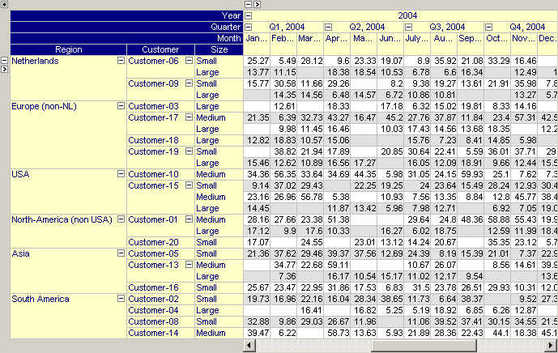

.. _Pivot-Table_End-UserControledLayoutand:

End-User Controled Layout and Contents
======================================

The pivot table view is highly customizable by the end-user and its contents can be rearranged in various ways to create all kinds of views of the data. To be more specific, the following types of customization are allowed.

**Tree-wise Data Organization** 

In the pivot table you can navigate through your data in a tree-wise manner. All relevant indices are structured in two separate trees (i.e. the row tree and the column tree), as illustrated in the picture below. You can collapse and expand any level in both trees in order to hide or reveal certain details in the pivot table.

|img_def_End-User_Controled_Layout_-_Tree-wise_png|

**Identifier Selection to Display** 

As a developer, you can specify whether a pivot table displays 

*   a fixed collection of identifiers selected by you, or
*   a dynamic selection of identifiers which can be chosen by the end-user

You can accomplish the latter by specifying a subset of ``AllIdentifiers``  to fill the pivot table. By allowing the end-user to modify the contents of this set (e.g. by using a selection object), the end-user can control the contents of the pivot table.

**Slicing and Outer Indices** 

An end-user can slice the pivot table by fixing some free index to a specific element or by specifying some free index to be an outer index of the object. This will reduce the size of the pivot table. The figure below shows a pivot table in which the index for the 'quarters' is an outer index and fixed to 'Q1, 2004' while for the 'Region' index only data for the element 'Europe (non-NL)' is shown.

|img_def_Figure_2_-_outer_indices_png|

**Rearranging the Index Order** 

The pivot table allows you to rearrange the order of indices. By dragging and dropping the headers between the distinct areas in the pivot table, you can group the data based on one or more of their indices. The figure below shows the same data as shown in the introduction but presented differently.

|img_def_End-User_Controled_Layout_-_Rearranging_png|

**Adding Aggregators** 

An end-user can extend the pivot table with all kinds of aggregator rows and/or columns. Aggregators can be used to compute standard statistical information (count, sum, average, etc) over your data on a certain level in the pivot table. Aggregator values are automatically updated as the layout of the table changes. The figure below shows a pivot table with two row aggregators, one on the regional level and one on the product level plus a single column aggregator on the yearly level. All three aggregators are displayed in red and compute the sum of the values on the underlying level.

|img_def_End-User_Controled_Layout_-_Adding_Aggregators_png|

**Sparse versus Dense View** 

The pivot table allows you to specify, on a per-index level, whether you want to see sparse or dense data. By default the pivot table will only display sparse data. That is, every row or column in the pivot table will at least have one non-default entry. In some views it makes more sense to display data in a dense manner, e.g. when displaying data over the set ``AllMonths``.

**Manually Add or Delete Rows/Columns** 

When an index is only showing sparse data, then those elements for which no data currently exists, are not shown in the table. This makes it impossible to specify new data for such an element. To allow you to add data for such an element you can either set the index to 'Dense' or you can manually insert 'missing' elements anywhere in the row- or column tree.

To do this you click at a specific location in either the row- or column area and then press the Insert key. The table will then present you with a list of elements that are currently not shown and you can pick the element that you want to insert (if only one element is available it will be inserted automatically). In this way you can add a new (empty) row or column in your table for which you can start entering values. 

In the figure below you see the result of pressing the Insert key while the focus is on element "Customer-19". The drop-down list allows you to pick any of the customers that are currently not shown for the region "Europe (non-NL)".

|img_def_PivotTable-ManuallyInsertDelete_png|

In a similar way you can also delete entire rows and columns from your table. Simply click on the specific element in either the row or column area and then press the Delete key. This delete action does not delete any data in the underlying identifier, it only adjusts your current view on the data. To re-insert the deleted row or column, you use the Insert key as described above.

Please note that manually inserting and deleting rows using the Insert and Delete key results in a temporary view of the table. As soon as the table redraws itself, due to underlying data changes or pivoting actions, these modifications to the view may get lost. Therefore, when creating a new empty row or column using the Insert key, you should start entering the values for the row and column before performing any other action that may again delete that row or column. 

**Filtering Indices** 

On each index in the pivot table, the end-user can apply a (temporary) filter such that only a subset of the elements are displayed. There are several types of filters available. In the figure below you see the effect of applying a "Starts With" filter on the index Month. See also :ref:`Pivot-Table_PivotTable_Index_Filtering` .

|img_def_PivotTable-IndexFiltering_png|

**Multiple Case View** 

Using the pivot table you can view data for multiple cases simultaneously. By making the object a multiple case object, an extra index in the set ``AllCases``  is added to the pivot table. This index can be moved around like any other index in the pivot table. In combination with the Difference or Range aggregator, this multiple case view is a convenient way to compare data amongst cases. Figure 5 shows a pivot table with multiple cases being displayed in the columns.

 

|img_def_End-User_Controled_Layout_-_Multiple_Case_View_png|

**Learn more about** 

*   :ref:`Pivot-Table_EndUserActions`

