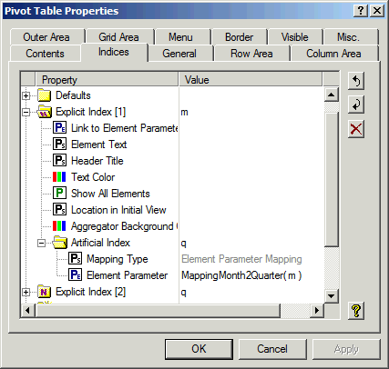

.. _Pivot-Table_Indices:

Indices
=======

On the Indices tab, you can specify how and where the indices appear in the Row, Column, and Outer areas.

**Defaults** 

In this Defaults section you can specify two properties for indices for which no explicit property has been set in the Explicit Indices below. For a description of the properties you are referred to the description for the Explicit Index section below.

**Defaults - Column Width** 

Here you can specify a numerical scalar identifier or constant that indicates the column width when the index level appears at the leaf nodes in the column tree. When you specify an updatable identifier here, changes made by the end-user are reflected in the value of the identifier. If this identifier is not updatable, the end-user will not be able to change the widths of the column whose length is specified by this property. The default column width will only be considered if no explicit column width has been specified.

**Defaults - Header Width** 

Here you can specify a numerical scalar identifier or constant that indicates the header width of headers that appear in the row tree, column tree or outer index area. When you specify an updatable identifier here, changes made by the end-user are reflected in the value of the identifier. If this identifier is not updatable, the end-user will not be able to change the widths of the headers whose length is specified by this property. The default header width will only be considered if no explicit header width has been specified.

**Explicit Index** 

In this section you can set properties for indices for which you know that they will or may appear in the Pivot Table. If you specify an index that is not in the domain of any of the identifiers specified on the Contents tab, it will be ignored. As soon as an identifier is added to the Pivot Table that does contain the index, the corresponding properties will have an effect.

**Explicit Index - Link to Element Parameter** 

Here you can specify an element parameter to be used as a 'Reverse Link': if the end-user selects a cell in the Pivot Table, the element parameter will be assigned the element value corresponding to the selected cell. Furthermore, the element parameter will also act as a 'Forward Link' if the index is placed in the Outer Area: if the value of the element parameter changes (through an assignment in the model or elsewhere in the gui) the outer index will be set to the newly assigned element and the contents of the table will be adjusted accordingly.

**Explicit Index - Element Text** 

With this property you can specify alternative display names for the elements in the set related to the given index. Usually, you will enter a one-dimensional string parameter with the given index as its domain. The string parameter may contain linebreak characters (inserted as '\n' characters in the string value). The pivot table will show linebreaks in the row and column tree. However, in case a linebreak character is present in a string that is displayed as the element text corresponding to a leaf in the row tree, the linebreak character is shown as a space character resulting in a pivot table in which every row only occupies a single line.

**Explicit Index - Header Title** 

Here you can enter an alternative name for the index. This name is used in the headers of the Row, Column or Outer areas.

**Explicit Index - Colors - Background Color** 

With this property you can define a specific background color for the given index. You can either enter a single (scalar) color, or a color parameter with the given index as its domain so that each element in the corresponding set has its own background color.

**Explicit Index - Colors - Text Color** 

With this property you can define a specific text color for the given index. You can either enter a single (scalar) color, or a color parameter with the given index as its domain so that each element in the corresponding set has its own text color.

**Explicit Index - Show All Elements** 

If you set this property to 'Yes', then the Pivot Table will display all elements of a referred set, even if there are no non-default values associated with a specific element. Please note, that this property setting can be overruled by the corresponding property in user mode on the Indices Tab of the Pivot Table Option dialog.

**Explicit Index - Column Width** 

Here you can specify a numerical identifier (scalar or indexed over the corresponding index) that indicates the column width when the index level appears at the leaf nodes in the column tree. When you specify a scalar identifier here, all columns will have identical width. When you specify an updatable identifier here, changes made by the end-user are reflected in the value of the identifier. If this identifier is not updatable, the end-user will not be able to change the column width. If no column width has been specified, the default column width as specified in the Defaults section (on the Indices tab) will be considered.

**Explicit Index - Header Width** 

Here you can specify a numerical scalar identifier or constant that indicates the header width of headers that appear in the row tree, column tree or outer index area. When you specify an updatable identifier here, changes made by the end-user are reflected in the value of the identifier. If this identifier is not updatable, the end-user will not be able to change the widths of the headers whose length is specified by this property. If no header width has been specified, the default header width as specified in the Defaults section (on the Indices tab) will be considered.

**Explicit Index - Location in Initial View** 

When a Pivot Table is opened without using a previously saved "State or Layout" (see :ref:`Pivot-Table_SaveaUser-SpecifiedLayout`), then the Pivot Table uses this property to determine in which area (Row, Column or Outer) a specific index is placed initially. If not specified, then the Pivot Table tries to place them in such a way that it results in a 'nice' view. Unless you disallow an end user to re-arrange the indices, the end-user can of course adjust the view once it is opened.

**Explicit Index - Aggregator Background Color** 

You can use this property to override the default aggregator background color (specified on the 'Grid Area' tab) for all aggregators that are associated with the given index. This use of this property might increase the visual structure of the pivot table when multiple aggregators and grand totals have been specified. 

**Explicit Index - Artificial Index** 

In this section you can specify a new index that will be virtually added to any identifier for which the explicit identifier is part of the domain. Artificial indices offer the possibility to extend the displayed domain of your identifiers without the need to extend the underlying model identifiers.

**Explicit Index - Artificial Index - Mapping Type** 

This property should be used to specify the way the relation between the existing index and the artificial index is specified. This relation should be specified through an element parameter, an indexed set or a two-dimensional binary relation.

**Explicit Index - Artificial Index - Element Parameter** 

When the relation between the existing index and artificial index is specified by an element parameter, an element parameter should be entered here. The existing index should be in the domain of the element parameter while the artificial index should correspond to the range of the element parameter.

**Explicit Index - Artificial Index - Set** 

When the relation between the existing index and artificial index is specified by an indexed set, the set should be entered here. The artificial index should be in the domain of the set while the existing index should correspond to the range of the indexed set. The model developer is responsible to make sure that every entry is displayed only once in the pivot table, so all sets have to be mutually disjunct.

**Explicit Index - Artificial Index - Identifier** 

When the relation between the existing index and artificial index is specified by a binary relation, an identifier should be entered here. This identifier should have two free indices, one corresponding to the existing index and the other to the artificial index. The model developer is responsible to make sure that every existing index is mapped to at most one artificial index. 

For example, when your pivot table contains a 4-dimensional identifier ``Sales`` (c,r,p,m) (c in ``Customers``, r in ``Regions``, p in ``Products``, m in ``Months``) and you would extend the pivot table with two articifial indices q in ``Quarters``  and y in ``Years``, together with two element parameters ``MappingMonth2Quarter`` (m) in ``Quarters``  and ``MappingQuarter2Year`` (q) in ``Years``  to specify the relation between months, quarters and years (as illustrated in the Figure below), the resulting pivot table would look as if it contained a 6-dimensional identifier ``Sales`` (c,r,p,m,q,y).

|img_def_Properties_-_Artificial_Indices_png|

**Identifier Index** 

If the Pivot Table contains multiple identifiers, these identifiers are represented in the Row, Column or Outer area using an artificial 'Identifier Index'. This index can be used similar to the regular set indices. In this section you can set the properties for this Symbol Index similarly as described above. 

Please note that

*   the **Link to Element Parameter**  property should refer to an element parameter in the set AllIdentifiers.

In addition there is one extra property.

**Identifiers Index - Hide if Single Identifier** 

If the Pivot Table only contains a single identifier, displaying the Symbol Index could occupy unnecessary space without adding too much value. With this option you can hide the symbol index in that situation. By default it is set to 'Yes'.

**Case Index** 

If the Pivot Table is set to multiple case view, the cases in the Multiple Cases selection are represented in the Row, Column or Outer area using an artificial 'Case Index'. This index can be used similar to the regular set indices. In this section you can set the properties for this Case Index similarly as described above. 

Please note that

*   the **Link to Element Parameter**  property should refer to an element parameter in the set AllCases.
*   the default for Show All Elements for the Case Index is set to '1', while it is '0' for all other indices. 

**Suffix Index** 

If you want to display multiple suffices for a single identifier in the Pivot Table (e.g. Lower and ``Upper``) you could decide to specify multiple entries on the Contents tab. Alternatively, you could choose to extend the Pivot Table with a 'Suffix Index'. This will allow you to deal with the suffices as if they were an index in the domain of the identifiers (i.e. you are allowed to move the suffix index around as if it was an ordinary index).

Please note that

*   the **Link to Element Parameter**  property should refer to an element parameter in the set AllSuffixNames.

In addition to the 'Case Index' there is one extra category of properties.

**Suffix Index - Explicit Suffix** 

The explicit suffices define the list of suffices to be displayed in the Pivot Table.

