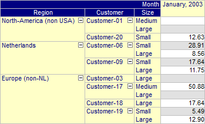
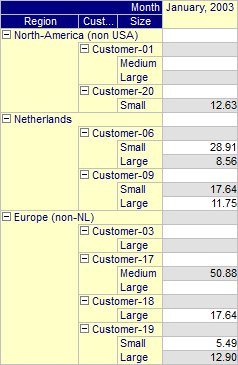
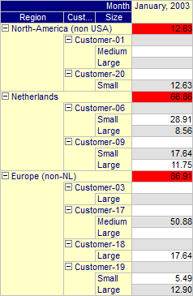

.. _Pivot-Table_RowArea:

Row Area
========

On the Row Area tab you can specify various font and color settings of the Row Area.

**Layout** 

With this property you can control the layout mode for the row area. Two layout modes are available: 'Column Mode' (default) and 'Indentation Mode'. In 'Column Mode', the row tree contains a single row for every leaf node in the tree. In 'Indentation Mode' the row tree contains a single row for every node in the tree (i.e. intermediate as well as leaf nodes). Although the row tree will contain more rows in 'Indentation Mode' (when compared to 'Column Mode'), the total width of the row tree needed to display all element labels can be smaller since, in 'Indentation Mode', the element text of two labels on the same path are indented as illustrated in the images below.

|img_def_Pivot_Table_-_Column_Mode_png|       |img_def_Pivot_Table_-_Indentation_Mode_png|

							

**Show First Aggregator at Parent** 

When the layout mode has been set to 'Indentation Mode', this property can be used to indicate that the extra row inserted should be used to display aggregator values (if present). The bottom most aggregator that has been inserted before the element list, will be displayed at this position. In this special case the aggregator text will not be displayed, as the row already shows the element text. The image below shows a pivot table for which a sum aggregator has been specified before the customer's element lists.

|img_def_Pivot_Table_-_Indentation_Mode_with_Aggregator_png|

**Text Color** 

With this property you can set the standard text color for the row area. If you want to have different colors for different indices in the row area tree, then should specify these on the Indices tab.

**Line Color** 

With this property you can set the color for the lines that are drawn in the row area tree.

**Font** 

With this property you can set the font for the row area.

**Headers** 

On the Header tab of the Row Area you can specify various font and color settings of the headers of the Row Area.

**Headers - Background Color** 

With this property you can set the background color for the headers in the row area. If you leave it empty, the background of the headers is the same as the background of the row area itself.

**Headers - Text Color** 

With this property you can set the text color for the headers in the row area. If you leave it empty, the text color of the headers is the same as the text color of the row area itself.

**Headers - Font** 

With this property you can set the font for the headers in the row area. If you leave it empty, the font used in the headers is the same as the font used in the row area itself.

**Headers - Show Sub Headers** 

If you are displaying multiple identifiers in the same pivot table and the row area tree contains the artificial 'Identifier' index, then the tree may display sub (or intermediate) headers in the middle of the tree. If you do not want these sub headers to appear, you can switch them off with this property. Note that this can also be done in user mode from within the Pivot Table Option dialog. See ….	

**Aggregators - Background Color** 

With this property you can set the background color for the aggregator text displayed in the row area. If you leave it empty, the background of the aggregators is the same as the background of the row area itself.

**Aggregators - Text Color** 

With this property you can set the text color for the aggregator text displayed in the row area. If you leave it empty, the text color of the aggregators is the same as the text color of the row area itself.

**Aggregators - Font** 

With this property you can set the font for the aggregator text displayed in the row area. If you leave it empty, the font used in the aggregators is the same as the font used in the row area itself.

**Grid Focus Indicator** 

On the Grid Focus Indicator tab of the Row Area you can specify various font and color settings of the leaf node element in the Row Area that corresponds with the cell in the grid area that has the focus. 

**Grid Focus Indicator - Background Color** 

With this property you can set the background color for the leaf node element in the row area that corresponds with the focus cell in the grid area. If you leave it empty, the font used is the same as the font used in the row area itself.

**Grid Focus Indicator - Text Color** 

With this property you can set the text color for the leaf node element in the row area that corresponds with the focus cell in the grid area. If you leave it empty, the text color used is the same as the text color used in the row area itself.

**Grid Focus Indicator - Font** 

With this property you can set the font for the leaf node element in the row area that corresponds with the focus cell in the grid area. If you leave it empty, the font used is the same as the font used in the row area itself.

