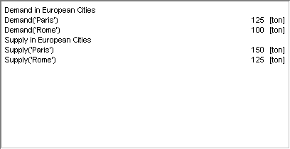

.. _Scalar_Scalar_Object_-_Introduction:

Scalar Introduction
=======================

**Description** 

In a Scalar object you can display and edit the value of one or more scalar identifiers. An identifier in a scalar object can either be a numerical, a string valued or an element valued identifier. Depending on the type of identifier and whether you want to display only one single identifier or a list of identifiers, you can choose different display styles:

*	Value(s) only. Only the value(s) of the identifier(s) are shown.
*	Text – Value. In front of each value a descriptive text is displayed.
*	Value – Text. At the right side of each value a descriptive text is displayed.

In the three display styles above, you can not directly edit the displayed value(s), but only when you start typing a new value or when you press the F2 or Ins key an edit field will appear. If you do not a descriptive text within the object and if the object only contains one single scalar identifier, then you can also choose a display style in which the edit field is always present. This means that the mouse cursor will change when it enters the scalar object, and that you can directly position the cursor anywhere in the text (this closely resembles the edit fields that you often see in dialog boxes). The two display styles that always show the edit field are:

*	Single Line Edit Field
*	Multiple Line Edit Field. (only for string valued identifiers)

The last display style allows you to enter a text for a string value parameter that consists of multiple lines of text (this is the only object in AIMMS in which you can do this). Additionally, you can use the Multiple Line Edit Field to show (but not edit) the contents of a text file.

An example of a scalar field is shown below.

|img_def_Scalar_Object_example_BMP|

**How to …** 

*	:ref:`Scalar_Creating_a_Scalar_Object`  
*	:ref:`Scalar_Scalar_Object_Properties_-_Con`  

**Learn more about** 

*	:ref:`Scalar_Scalar_Object_Properties`  

