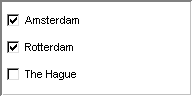

.. _Selection_Selection_Object_Data_-_(Sub)s:

Selection Object Data - (Sub)set
================================

**Description** 

If you use a subset in a selection object, then you can let the user directly fill in the contents of that subset. The list of elements to select from corresponds to a 'superset' of that set, which is given during the creation of the object. If no superset is provided, then the object only displays the current contents of the set itself, and the user can NOT make any modifications. To specify the superset containing the elements that the user can construct the contents of the subset from, you should use the following syntax:

``Subset(superset)`` 

**Example** 

Data:

	``Cities := data { 'Amsterdam', 'Rotterdam', 'The Hague' };`` 

	``CitiesWithHarbor := data { 'Amsterdam', 'Rotterdam' };`` 

Corresponding check boxes for CitiesWithHarbor( Cities ):

|img_def_checkbox3_bmp| 

**Note** 

*	If you do not specify a superset and only display the contents of an updatable master set, then you can give the user the possibility to modify the set by adding the Add/Remove buttons.

**How to …** 

*	:ref:`Selection_Selection_Object_-_Introducin1`  

