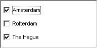

.. _Selection_Selection_Object_Data_-_1_dime:

Selection Object Data - 1 dimensional identifier
================================================

**Description** 

With a 1-dimensional identifier in a selection object you can store both single and multiple selections. The object uses the identifier as if it is an array containing only 0 and 1 values: if the value is 0 then the corresponding element is deselected, if 1 then it is selected.

The list of available options corresponds to the elements of the free index of the identifier. When a user makes a selection this may lead to multiple data changes: previously selected items are reset to 0, and newly selected items are set to 1.

**Example** 

Data:

	``P(c) := data { 'Amsterdam' : 1, 'Rotterdam' : 0, 'The Hague' : 1 };`` 

Corresponding check boxes:

|img_def_checkbox1_bmp|

**Note** 

*	If the identifier has values other than 0 or 1, then these values are regarded as NOT 0 and thus result in a selected element. These other values can only be used for showing a current selection. If the user makes a new selection, then the object only uses the standard values 0 or 1.
*	You should make sure that the identifier that is used for a single selection object initially does not contain multiple non-zeroes. For radio buttons this leads to an unfamiliar situation in which multiple buttons are selected, and a list box or drop down list will only show one of the selected elements, and ignore all other.

