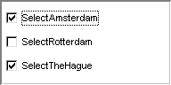

.. _Selection_Selection_Object_Data_-_Multip:

Selection Object Data - Multiple scalars
========================================

**Description** 

A selection object containing multiple scalar identifiers is similar to an object with a 1-dimensional identifier in a sense that the current selection is represented via 0 and 1 values. This is the only type of selection object in which the list of selectable options does not correspond to a set in the model. Instead, the options correspond to the number of scalars added. If a user makes a selection, this may lead to multiple data changes: the previously selected scalars are set to 0, and the newly selected scalars are set to 1.

**Example** 

Data:

	``SelectAmsterdam := 1 ;`` 

	``SelectRotterdam := 0 ;`` 

	``SelectTheHague := 1 ;`` 

Corresponding check boxes:

|img_def_checkbox2_bmp| 

**Note** 

*	A selection object may contain only one scalar identifier. This is particular useful in combination with a check box. The user can then toggle a specific choice on or off by clicking on the check box.

