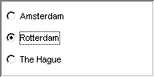

.. _Selection_Selection_Object_Data_-_Scalar:

Selection Object Data - Scalar and set
======================================

**Description** 

A combination of a scalar identifier and a set can be used if, for example, your model uses an integer to represent a specific option value. In this case, the set is only used to present the available values textually and the scalar will get the value of the n-th selected element.

**Example** 

Data:

	``Cities := data { 'Amsterdam', 'Rotterdam', 'The Hague' };`` 

	``IndexSelectedCity := 2 ;`` 

Corresponding radio buttons:

|img_def_radiobuttons_bmp| 

**Note** 

*	By default the first element from the set corresponds to the scalar value 1. Via the properties dialog box you can change this value.

