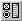

.. _Selection_Creating_a_Selection_Object:

Create a Selection Object
=========================

To create a new selection object on a page:

1.	While in Edit Mode, select Selection |img_def_Selection_Object_button_bmp| from the Object menu.

2.	On the page, drag a rectangle where you want the selection object to appear.

An Identifier Selection dialog box appears.

3.	Select the type of selection object.

4.	Select the type of identifier that you want to display.

5.	Select the identifiers that you want to display in the selection object.

6.	Click Ok.

**Note** 

*	The selected identifier (slice) should be of the data type that you selected. If you want to use multiple scalar identifiers, you should first select one identifier here. Any additional scalars can be added via the Contents tab of the Properties dialog box.
*	Which type of control you should use (radio buttons, check boxes, drop down list or list box) depends on the available space on your page and also on the number of elements to choose from. If you have a large number of elements, then it is not recommended to use radio buttons or check boxes (because this may take too much of the available Windows' resources).

**How to …** 

*	:ref:`Selection_Selection_Object_Properties_-1`  

**Learn more about** 

*	:ref:`Selection_Selection_Object_Properties`  

