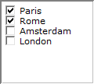

.. _Selection_Selection_Object_Introduction:

Selection Object Introduction
================================

**Description** 

The selection object offers some standard mechanisms to let the user pick one or more items from a list. Depending on whether the user should be able to select multiple items or only one single item you can use the following subtypes of selection controls:

*	Radio buttons (single selection)
*	Check boxes (multiple selection)
*	List boxes (single / multiple selection)
*	Drop-down list boxes (single selection)

Additionally the selection object can also be used to only display the users current choice in a textual representation, either by displaying the name of the single selected items, or a list of all selected items.

In most situations, the list of options from which a user can select corresponds to a set in your model, so by choosing one or more items from that list, the user actually selects a number of elements. Which elements are currently selected can be stored in different model identifiers, such as:

*	An element parameter (only for a single selection)
*	A subset
*	An one-dimensional identifier (using 1 for a selected element, and 0 otherwise)
*	An integer valued identifier, storing the sequence (ordinal) number of the selected element (only for a single selection).

Alternatively, you can also create a list of options that correspond to multiple numerical scalar identifiers. Similar as to the one-dimensional identifier, a selected option (=scalar identifier) will then get a value of 1 if it is selected, and a value of 0 if it is deselected.

An additional option of the selection object is that it can be used to add new elements to a set, or remove existing elements from it. This is done by adding two small buttons to the object (one for adding an element [+] and one for deleting an element [x] ) and an editable field for entering the element name to add or remove. This option is only available in combination with list boxes or drop down lists.

An example of a selection object is shown below.

|img_def_Selection_Object_Checkbox_example_BMP|

**Note** 

*	There is a limit on the number of elements that can be shown in dropdown lists and list boxes: 32767.

**How to …** 

*	:ref:`Selection_Creating_a_Selection_Object`  
*	:ref:`Selection_Selection_Object_Properties_-1`  
*	:ref:`Selection_Selection_Object_-_Introducin1`  
*	:ref:`Selection_Selection_Object_-_Introducing`  

**Learn more about** 

*	:ref:`Selection_Selection_Object_Properties` 
*	:ref:`Selection_Selection_Object_Radio_Buttons`  
*	:ref:`Selection_Selection_Object_-_Checkboxes`  
*	:ref:`Selection_Selection_Object_-_List_Box`  
*	:ref:`Selection_Selection_Object_-_Drop_Down_L`  
*	:ref:`Selection_Selection_Object_Data_-_Elemen`  
*	:ref:`Selection_Selection_Object_Data_-_1_dime`  
*	:ref:`Selection_Selection_Object_Data_-_Scalar`  
*	:ref:`Selection_Selection_Object_Data_-_Multip`  
*	:ref:`Selection_Selection_Object_Data_-_(Sub)s`  

