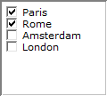

.. _Selection_Selection_Object_-_Checkboxes:

Checkboxes
==========

**Description** 

The checkboxes selection object shows all elements. You can select or deselect elements by clicking on them. Here is an example of a Checkbox.

|img_def_Selection_Object_CheckBox_example_BMP|

