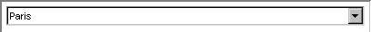

.. _Selection_Selection_Object_-_Drop_Down_L:

Drop Down List
==============

**Description** 

The drop down list shows the selected element. When you click the arrow down button, you see the list of entries. You can select one entry with the mouse after which the list will close. Here is an example of a drop down list.

|img_def_Selection_Object_DropDownList_example_BMP|

