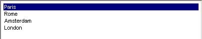

.. _Selection_Selection_Object_-_List_Box:

Listbox
=======

**Description** 

The list box shows all elements. You can select elements with the mouse. It is also possible to introduce an edit field so that you can select an item by typing (the first part of) it. A list box can have multiple columns. Here is an example of a Listbox.

If there are too many items to fit in the list box, then by default a vertical scrollbar will appear. If the item names are rather small, and your listbox is wide enough, then you choose to display multiple columns, which eventually will result in a horizontal scrollbar.

If the selection object allows multiple selections in the list box, then you can use the common control and shift key combinations to select whole ranges of elements.

|img_def_Selection_Object_ListBox_example_BMP|

