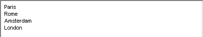

.. _Selection_Selection_Object_-_Text_Item:

Text Item
=========

**Description** 

The text item is used only to display a current selection. Here is an example of a Text Item.

|img_def_Selection_Object_TextItem_example_BMP|

