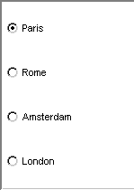

.. _Selection_Selection_Object_Radio_Buttons:

Radio Buttons
=============

**Description** 

The radio buttons selection object shows all the entries and allows you to select one by mouse clicking on one of the entries. You can see which entry is currently selected because the circular field next to it is filled with a black dot. Here is an example of radio buttons 

|img_def_Selection_Object_RadioButtons_example_BMP|

