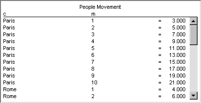

.. _Sparse-List_Sparse_List_Introduction:

Sparse List Introduction
===========================

**Description** 

A Sparse List can be used to display and edit only the non-default values of an indexed identifier. The object consists of an optional title and column header followed by the list of non-default tuples and their corresponding values. The end-user can edit the presented values, but if the value is set to the default value, the entry will automatically be removed from the list. The object can thus not be used to change a value from default to non-default. It is possible the show more than one identifier in a Sparse List, in which case the free indices of the different identifiers should match. The entries for additional identifiers will be placed under the entries from the first identifier, without making any distinction where the first entries of the first identifiers end and the entries for the second identifier start.

An example of a Sparse List is shown below.

|img_def_Sparse_List_example_BMP|

**Tips & Tricks** 

*	With the new Composite Table object of AIMMS you can display exactly the same information as in a Sparse List. In addition, the Composite Table offers many features for sorting the rows, adjusting column widths, adding and removing rows, etc. To simulate a Sparse List in a Composite Table you should use the identifier that you want display for both the domain and the first column of the Composite Table.

**How to …** 

*	:ref:`Sparse-List_Creating_a_Sparse_List`  
*	:ref:`Sparse-List_Sparse_List_Properties_-_Conte`  

**Learn more about** 

*    :ref:`Sparse-List_Sparse_List_Properties`  

