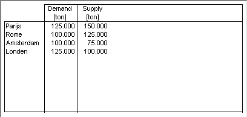

.. _Table_Table_Introduction:

Introduction
============

**Description** 

In a Table object, you can display and edit the values of one or more identifiers, the values of the specified identifiers are displayed in a tabular form. The most common form of a table is one in which you display a two-dimensional identifier; the elements of the first domain index are then displayed as the rows, the elements of the second index as the columns of the table. The Table object in AIMMS is capable of displaying identifiers of any dimension. To fit multiple dimensions in a two-dimensional table representation, the rows and columns in the table use a special hierarchical structure. If you combine multiple (indexed) identifiers in one table, AIMMS recognizes those indices that appear in multiple identifiers and tries to structure the table accordingly.

The identifiers in a table can be any combination of numerical, string or element valued identifiers.

 

An examples of a Table object is shown below.

|img_def_Table_example_BMP|

**How to …** 

*	:ref:`Table_Creating_a_Table`  
*	:ref:`Table_Table_Properties_-_Contents`  

**Learn more about** 

*	:ref:`Table_Table_Properties`  
*	:ref:`Table_Table_Properties_-_Table`  

