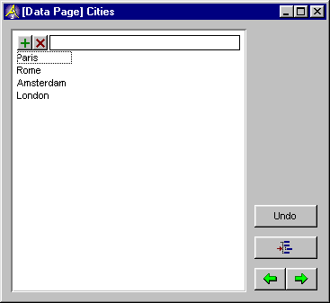

.. _Page-Manager_Data_Page:

Data Page
=========

**Description** 

In the Model Explorer you can at any time inspect (and edit) the data of an identifier, using the Data command. This command creates a (temporary) data page in which the identifier is displayed using a suitable type of page object.

To open a data page for an identifier:

1.	Select the identifier in either the Model Tree or in attribute window.

2.	From the Edit menu, select Data (or select Data from the right-mouse popup menu).

For example, the data page for a set Cities will look like this:

|img_def_Data_Page_Set_example_bmp| 

During the creation of the data page, AIMMS chooses a suitable type of object to display the identifier data. This choice depends on both the type of the identifier and the dimension of the identifier. 

Depending on the type of identifier, the object used to display the data of the selected identifier is a scalar, a table, a composite table, a pivot table, or a sparse list. Some types of identifiers can be displayed in different types of objects. On the data pages of these types of identifiers a construct button is displayed. If you click the construct |img_def_data_page_construct_button_bmp| button, a dialog box will be opened. If you click the Model Explorer |img_def_data_page_model_explorer_button_bmp| button the focus will go back to the Model Explorer. If you click the previous |img_def_data_page_previous_button_bmp| button, a data page will be opened for the previous identifier in the Model Tree, if you click the next |img_def_Data_Page_Next_button_bmp| button, a data page will be opened for the next identifier in the Model Tree.

As with any other page, you can make changes to the page. This can be changes in data, or changes in the lay-out of the page. If you have made any data changes and click the undo |img_def_data_page_undo_button_bmp| button, the changes will be discarded. If you have made any lay-out changes and save the page, a page will be constructed with the name "[Data Page] <Identifier Name>". The next time you ask the data for this identifier, this page will be opened. The page will be saved in the Page Tree as a subnode of the page "All Data Pages".

**Remark** 

For variables and constraints data pages will show all suffices for which nondefault data is available in a single pivot table.

**Learn more about** 

*	:ref:`Page-Manager_Construct_Identifier_Dialog_Bo`  
*	:ref:`Page-Manager_Page_Objects_Introduction`  
*	:ref:`aimmshelp9-Page_Manager_Introduction`  
*	:ref:`Page-Manager_All_Data_Pages`  

