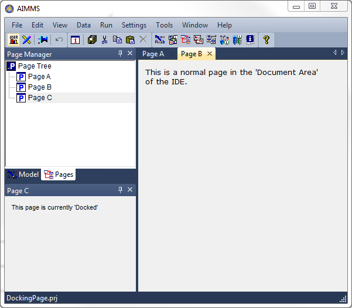
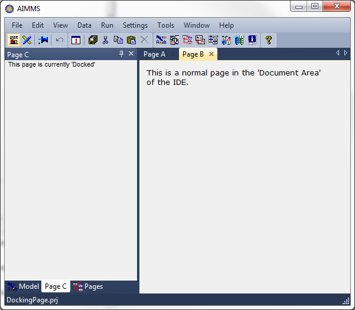
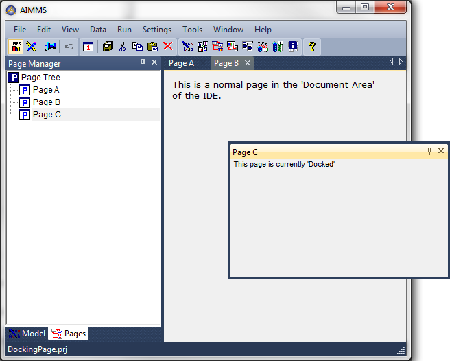

.. _Page-Manager_Making_a_Page_dockable:

Making a Page dockable
======================

By default, a page that is opened appears in the Document Area of the IDE (which is the area inside the main AIMMS window that is not being occupied by any of the docked windows). For most pages this is quite natural, because usually an end-user navigates to a page, inspects and/or modifies the data on it, and then navigates to another page.

However, an application may also contain several pages that an end-user wants to be able to see almost at any time, for example as a kind of dashboard to keep a good overview on what is going on. Therefore, using the properties of a page, you can specify a page to be 'Allow User Dockable' or even 'Always Docked'.

In the figure below, you see three pages. **Page A**  and **Page B**  are 'normal' pages in the Document Area,**Page C** is currently docked in the left-bottom corner. 

|img_def_DockedPage_png|

Of course you can also dock this page to other locations, for example as a tab next to the Model Explorer and Page Manager tool windows, as shown in the following picture.

|img_def_DockedPage2_png|

Or, still docked, but 'floating':

|img_def_FloatingLayout_png|

**Learn more about** 

*	:ref:`Page-Manager_Switching_a_page_between_Docke` 
