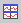

.. |img_def_User_Mode_button_bmp| image:: images/User_Mode_button.bmp
.. |img_def_Save_button_bmp| image:: images/Save_button.bmp
.. |img_def_First_Page_button_bmp| image:: images/First_Page_button.bmp
.. |img_def_Save_All_button_bmp| image:: images/Save_All_button.bmp
.. |img_def_Cut_button_bmp| image:: images/Cut_button.bmp
.. |img_def_Copy_Button_bmp| image:: images/Copy_Button.bmp
.. |img_def_Paste_button_bmp| image:: images/Paste_button.bmp
.. |img_def_Remove_button_Model_Tree_bmp| image:: images/Remove_button_Model_Tree.bmp
.. |img_def_Properties_button_bmp| image:: images/Properties_button.bmp

.. |img_def_Bar_Chart_button_bmp| image:: images/Bar_Chart_button.bmp
.. |img_def_Curve_button_bmp| image:: images/Curve_button.bmp

.. |img_def_Model_Explorer_button_bmp| image:: images/Model_Explorer_button.bmp
.. |img_def_Identifier_Selector_button_bmp| image:: images/Identifier_Selector_button.bmp
.. |img_def_Page_Manager_button_bmp| image:: images/Page_Manager_button.bmp
.. |img_def_Template_Manager_button_bmp| image:: images/Template_Manager_button.bmp
.. |img_def_Menu_Builder_button_bmp| image:: images/Menu_Builder_button.bmp

.. _Page-Manager_Page_Edit_Mode_-_Toolbar:

Edit Mode - Toolbar
===================

**Description** 

A page in Edit mode is equipped with a non-default Toolbar.

From this Toolbar, you can choose the following actions:

*	|img_def_User_Mode_button_bmp| :ref:`aimmshelp2-Page_User_Mode`  
*	|img_def_Save_button_bmp| :ref:`Miscellaneous_Save_a_Page`  
*	|img_def_First_Page_button_bmp| :ref:`option-AIMMS-startup_page` 
*	|img_def_Save_All_button_bmp| :ref:`Miscellaneous_Saving_a_Project`  
*	|img_def_Cut_button_bmp| :ref:`Page-Manager_Cut_Copy_Paste_and_Delete_on_a`  
*	|img_def_Copy_Button_bmp| :ref:`Page-Manager_Cut_Copy_Paste_and_Delete_on_a`  
*	|img_def_Paste_button_bmp| :ref:`Page-Manager_Cut_Copy_Paste_and_Delete_on_a`  
*	|img_def_Remove_button_Model_Tree_bmp| :ref:`Page-Manager_Cut_Copy_Paste_and_Delete_on_a`  
*	|img_def_Properties_button_bmp| :ref:`Page-Manager_Page_Properties`  
*	|img_def_Select_button_bmp| :ref:`Page-Manager_Selecting_Objects_on_a_Page`  
*	|img_def_Table_button_bmp| :ref:`Table_Table_Introduction`  
*	|img_def_Composite_Table_button_bmp| :ref:`Composite-Table_Composite_Table_-_Introduction`  
*	|img_def_New_Pivot_Table_Button_bmp| :ref:`Pivot-Table_AreasofthePivotTable` 
*	|img_def_Scalar_Object_button_bmp| :ref:`Scalar_Scalar_Object_-_Introduction`  
*	|img_def_Bar_Chart_button_bmp| :ref:`Bar-Chart_Bar_Chart_Introduction`  
*	|img_def_Curve_button_bmp| :ref:`Curve_Curve_Introduction`  
*	|img_def_Gantt_Chart_button_bmp| :ref:`Gantt-Chart_Gantt_Chart_Introduction`  
*	|img_def_Network_Object_button_bmp| :ref:`Network_Network_Object_-_Introduction`  
*	|img_def_ActiveX_Object_Button_bmp| :ref:`2D-Chart_2D_Chart_-_Introduction`  
*	|img_def_Button_button_bmp| :ref:`Button_Button_Introduction`  
*	|img_def_Navigation_Object_button_bmp| :ref:`Navigation_Navigation_Object_Introduction`  
*	|img_def_Selection_Object_button_bmp| :ref:`Selection_Selection_Object_Introduction`  
*	|img_def_Floating_Index_button_bmp| :ref:`Floating-Index_Floating_Index_Introduction`  
*	|img_def_Tabbed_Page_Object_Button_bmp| :ref:`Tabbed-Page_Tabbed_Page_Object_-_Introduct`  
*	|img_def_Indexed_Page_Object_Button_bmp| :ref:`Indexed-Page_Indexed_Page_Object_-_Introduc`  
*	|img_def_Model_Explorer_button_bmp| :ref:`aimmshelp3-Model_Explorer_Introduction`  
*	|img_def_Identifier_Selector_button_bmp| :ref:`aimmshelp21-Identifier_Selector`  
*	|img_def_Page_Manager_button_bmp| :ref:`aimmshelp9-Page_Manager_Introduction`  
*	|img_def_Template_Manager_button_bmp| :ref:`aimmshelp10-Template_Manager_Introduction`  
*	|img_def_Menu_Builder_button_bmp| :ref:`aimmshelp18-Menu_Builder_Introduction`  

**Learn more about** 

*	:ref:`Menu-Builder_Tool_bars`  
*	:ref:`aimmshelp1-Page_Edit_Mode` 

