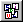

.. |img_def_First_Page_button_bmp| image:: images/First_Page_button.bmp
.. |img_def_Save_All_button_bmp| image:: images/Save_All_button.bmp
.. |img_def_Model_Explorer_button_bmp| image:: images/Model_Explorer_button.bmp

.. |img_def_Page_Manager_button_bmp| image:: images/Page_Manager_button.bmp
.. |img_def_Template_Manager_button_bmp| image:: images/Template_Manager_button.bmp
.. |img_def_Menu_Builder_button_bmp| image:: images/Menu_Builder_button.bmp

.. _Page-Manager_Page_Resize_Try_Mode_-_Toolbar:

Resize Try Mode - Toolbar
=========================

**Description** 

A page in resize try mode is equipped with a toolbar.

From this toolbar, you can choose the following actions:

*	|img_def_User_Mode_button_bmp| :ref:`Page-Manager_User_Mode`  
*	|img_def_Save_button_bmp| :ref:`Miscellaneous_Save_a_Page`  
*	|img_def_First_Page_button_bmp| :ref:`Options_Startup__authorization_-_Star3` 
*	|img_def_Save_All_button_bmp| :ref:`Miscellaneous_Saving_a_Project`  
*	|img_def_Model_Explorer_button_bmp| :ref:`Model-Explorer_Model_Explorer_-_Introduction`  
*	|img_def_Identifier_Selector_button_bmp| :ref:`Identifier-Selector_Identifier_Selector`  
*	|img_def_Page_Manager_button_bmp| :ref:`Page-Manager_Page_Manager_Introduction`  
*	|img_def_Template_Manager_button_bmp| :ref:`Template-Manager_Template_Manager_Introduction`  
*	|img_def_Menu_Builder_button_bmp| :ref:`Menu-Builder_Menu_Builder_Introduction`  

**Learn more about** 

*	:ref:`Menu-Builder_Tool_bars`  
*	:ref:`Page-Manager_Resize_Try_Mode` 

