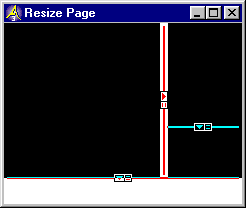
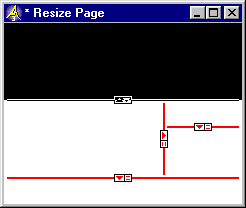

.. _Page-Manager_Inserting_a_Split_Line_Area:

Inserting a Split Line Area
===========================

**Description** 

Starting from the first split line that divided the page into two subrectangles, all split lines are contained in a hierarchy that defines how these rectangles are further divided in subrectangles. Using the New Split Line commands you can only create lines at the bottom of this hierarchy (dividing one of the remaining subrectangles).

With the Insert Area commands from the Edit menu, you can also insert a split line in this hierarchy of split lines. Given an existing split line and the rectangle this line divides, you can choose to insert a new area either at the top, bottom, left or right of this rectangle. For example, if you insert a new area at the top, then a new horizontal split line is created in the middle of the rectangle, and the new subrectangle above this line will be empty, while the subrectangle below the split line will contain the original split line (and its underlying hierarchy).

|img_def_split_area_1_bmp|

Press |img_def_insert_area_top_bmp|

|img_def_split_area_2_bmp|

To insert a split line in the existing hierarchy of lines:

1.	Open the page in Resize Edit mode.

2.	Select a split line (which implicitly selects a subrectangle).

3.	From the Edit menu, select |img_def_insert_area_top_bmp| Insert Area at Top (or any of the other three similar commands).

