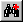

.. |img_def_First_Page_button_bmp| image:: images/First_Page_button.bmp
.. |img_def_Save_All_button_bmp| image:: images/Save_All_button.bmp
.. |img_def_Cut_button_bmp| image:: images/Cut_button.bmp
.. |img_def_Copy_Button_bmp| image:: images/Copy_Button.bmp
.. |img_def_Paste_button_bmp| image:: images/Paste_button.bmp
.. |img_def_Remove_button_Model_Tree_bmp| image:: images/Remove_button_Model_Tree.bmp
.. |img_def_Find_button_bmp| image:: images/Find_button.bmp

.. |img_def_User_Mode_button_bmp| image:: images/User_Mode_button.bmp
.. |img_def_Model_Explorer_button_bmp| image:: images/Model_Explorer_button.bmp
.. |img_def_Identifier_Selector_button_bmp| image:: images/Identifier_Selector_button.bmp
.. |img_def_Page_Manager_button_bmp| image:: images/Page_Manager_button.bmp
.. |img_def_Template_Manager_button_bmp| image:: images/Template_Manager_button.bmp
.. |img_def_Menu_Builder_button_bmp| image:: images/Menu_Builder_button.bmp

.. _Page-Manager_Page_Manager_-_Toolbar:

Toolbar
=======

**Description** 

The Page Manager is equipped with a non-default Toolbar.

From this Toolbar, you can choose the following actions:

*	|img_def_First_Page_button_bmp| :ref:`option-AIMMS-startup_page` 
*	|img_def_Save_All_button_bmp| :ref:`Miscellaneous_Saving_a_Project`  
*	|img_def_Cut_button_bmp| :ref:`Page-Manager_Cut_Copy_and_Paste_in_the_Page`  
*	|img_def_Copy_Button_bmp| :ref:`Page-Manager_Cut_Copy_and_Paste_in_the_Page`  
*	|img_def_Paste_button_bmp| :ref:`Page-Manager_Cut_Copy_and_Paste_in_the_Page`  
*	|img_def_Remove_button_Model_Tree_bmp| :ref:`Page-Manager_Cut_Copy_and_Paste_in_the_Page`  
*	|img_def_Find_button_bmp| :ref:`Miscellaneous_AIMMS_Trees`  
*	|img_def_Find_Again_button_bmp| :ref:`Miscellaneous_AIMMS_Trees`  
*	|img_def_Page_New_button_bmp| :ref:`Page-Manager_Creating_a_Page`  
*	|img_def_Edit_Mode_button_bmp| :ref:`Page-Manager_Edit_Mode`  
*	|img_def_User_Mode_button_bmp| :ref:`Page-Manager_User_Mode`  
*	|img_def_Model_Explorer_button_bmp| :ref:`Model-Explorer_Model_Explorer_-_Introduction`  
*	|img_def_Identifier_Selector_button_bmp| :ref:`Identifier-Selector_Identifier_Selector`  
*	|img_def_Page_Manager_button_bmp| :ref:`Page-Manager_Page_Manager_Introduction`  
*	|img_def_Template_Manager_button_bmp| :ref:`Template-Manager_Template_Manager_Introduction`  
*	|img_def_Menu_Builder_button_bmp| :ref:`Menu-Builder_Menu_Builder_Introduction`  

**Learn more about** 

*	:ref:`Menu-Builder_Tool_bars`  
*	:ref:`Page-Manager_Page_Manager_Introduction` 

