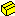
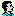

.. _Security_Nodes_in_the_User_Tree:

Nodes in the User Tree
======================

**Description** 

The User Tree can contain three different types of nodes. The User Tree can contain

*	|img_def_User_Tree_Root_node_bmp| a single root node,
*	|img_def_User_Tree_Group_node_bmp| group nodes, to structure the users, and
*	|img_def_User_Tree_User_node_bmp| user nodes, to define individual users.

The following table shows the allowed parent-child relations in the User Tree.

.. list-table::

   * - Parent Child
     - Root
     - Group User
   * - Group
     - ÖÖ
     - ÖÖ
   * - User
     - 
     - ÖÖ

		

**Learn more about** 

*	:ref:`Security_User_Tree_Node_Properties`  

