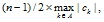

.. _Artificial_Cost_Increase_Factor:
.. _NETSOL_Artificial_Cost_Increase_Factor:

Artificial Cost Increase Factor
===============================

**Type** :	Floating point number

**Range** :	[0,inf)	

**Default** :	0

This option controls how the cost on artificial arcs is increased when no feasible solution is found in the first phase of the algorithm. If this value is less than or equal to 1.0, the artificial cost is set to 

|img_def_ArtificialCost_jpg|

where n is the number of nodes, A is the set of arcs and ck is the cost along the (original) arc k. This value guarantees that artificial arcs carry zero flow in the optimal solution. For values larger than 1.0, the current setting of the artificial cost, which is determined by the value of the option **Artificial Cost Setting** , is increased by a factor that equals the value of this option.

**Learn more about** 

*   :ref:`NETSOL_Artificial_Cost_Setting_` 

