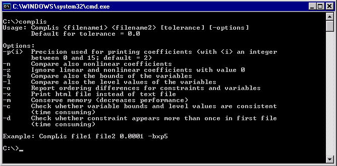

.. _CompLis:
.. _CompLis_CompLis:

CompLis
=======

**Description** 

CompLis is a tool for comparing two AIMMS constraint listings. Constraint listings are printed in an AIMMS
listing file if the option **Constraint Listing** is set. AIMMS will add variable values to the constraint
listing if the option **Constraint Listing Variable Values** equals 'Print variable values'.

An AIMMS constraint listing displays the constraints generated by AIMMS for some mathematical program. By
using CompLis it is therefore possible to compare two mathematical programs generated by two different AIMMS
projects. CompLis can handle constraint listings generated by any AIMMS version, hence it is possible to compare
a constraint listing generated by an AIMMS 25.5 project with one generated by an AIMMS 4.70 project.

CompLis can handle listing files that contain more than one constraint listing. In that case it will compare the
first constraint listing of file A with the first constraint listing of file B, the second constraint listing of
file A with the second constraint listing of file B, and so on.

CompLis is a Win32 executable and can only be run from the command prompt. CompLis will write its output to the
file 'complis.log' unless the option 'x' for writing in HTML format is set in which case the output is written to
the file 'complis.html'.

**Usage** 

If you type 'complis' at the command prompt you will see something similar to the picture below.

|img_def_cl2_bmp|

The text printed summarizes how CompLis should be used and it gives a short description of the options that can be used.
The arguments 'filename1' and 'filename2' are obligatory (unless the single file mode is used). If you use a .lis file
then you do not have the write the .lis extension; for other extensions you have to write the full name of the file.

The optional argument 'tolerance' specifies the (absolute) tolerance that CompLis should use for comparing two coefficients,
right-hand side-values, level values, etc. If possible, you should use the same number of significant digits used for
numbers printed in constraint listings in both listing files. This is controlled by the AIMMS option **Listing Number Precision**.

The options that can be used for the optional argument '-options' are described in more detail in the Options (normal mode)
section. Note that the '-bxp5' in the example means that the options 'b' (comparing variable values) and 'x' (HTML format)
are set, and that the precision for printing coefficients is set to 5.

**Output** 

CompLis writes its output in the following format:

.. code-block:: text
   :linenos:

    Comparing 'contract_alloc1.lis' vs 'contract_alloc2.lis' (options 'bl'):
    
    Constraints:
    ------------
    GenerationIncidenceDetermination(London,England):
       number of variables differs	
       variable Generation(London,England) not in file 'contract_alloc1.lis'
       rhs differs (0.00E+000 vs 1.00E+001)
    
    Variables:
    ----------
    Generation(Paris,France):
       lower bound differs (3.00E+001 vs -1.00E+020)
    Generation(Rome,Italy):
       level value differs (1.00E+001 vs 2.00E+000)

At line 1 the names of the first and second listing file are printed. Also the options (if any) are shown.
If the tolerance would be unequal to 0, its value would also have been printed at line 1. Lines 3-8 show
the differences that CompLis found when comparing the constraints; lines 10-15 show the differences that
CompLis found when comparing the variables, i.e., the level values and/or the lower and upper bounds of the variables.

Line 5 shows the name of a constraint for which a difference was found. Line 6 shows that the number of variables
are different for constraint 'GenerationIncidenceDetermination(London,England)', and the reason for that is that
variable 'Generation(London,England)' does not exist in this constraint in the first file (line 7). Line 8 specifies
that the right-hand-side values are different, namely 0 in 'contract_alloc1.lis' and 10 in 'contract_alloc2.lis'.

Lines 12 and 14 show the names of the variables for which a difference was found. Line 13 shows that the lower bound
of variable 'Generation(Paris,France)' is 30 in the first file and -1e20 in the second file. Line 15 shows that the
level value of variable 'Generation(Rome,Italy)' is 10 in the first file and 2 in the second file.

If CompLis would conclude that both files contain the same constraint listing(s) then the output file would contain:

.. code-block:: text
   :linenos:

    Comparing 'contract_alloc1.lis' vs 'contract_alloc2.lis' (options 'bl'):
    
    No differences.

In case the HTML format is chosen, CompLis will print the name of the first file in red as well as all corresponding
coefficients. It will print the name of the second file and all corresponding coefficients in green.

**Ordering** 

By default, CompLis ignores permutations of rows and columns. For example, assume we have one constraint listing containing

.. code-block:: text

    ---- row1
    
    row1 .. [ 1 | 1 | after ]
    
      + 4 * x1 + 2 * x2 + 3 * x3 <= 8 ; (lhs=8)
    
    
    ---- row2
    
    row2 .. [ 1 | 2 | after ]
    
      + 1 * x1 + 3 * x2 + 2 * x3 <= 8 ; (lhs=7)

and another constraint listing containing

.. code-block:: text

    ---- row2
    
    row2 .. [ 1 | 1 | after ]
    
      + 1 * x1 + 2 * x3 + 3 * x2 <= 8 ; (lhs=7)
    
    
    ---- row1
    
    row1 .. [ 1 | 2 | after ]
    
      + 4 * x1 + 3 * x3 + 2 * x2 <= 8 ; (lhs=8)

Note that the ordering of the rows 'row1' and 'row2' and the columns 'x2' and 'x3' is different in the second
constraint listing. For this example, CompLis will conclude that both constraint listings are equal (unless
the ordering option 'o' is set).

**Remark** 

CompLis will ignore solution listings that are inside the listing files. CompLis cannot be used for constraint
listings created by the :ref:`Math Program Inspector <aimmshelp26-Math_Program_Inspector>`.

**Learn more about** 

*	:ref:`CompLis_Singlefilemode`  
*	:ref:`CompLis_CompLis_Options`  
*	:ref:`option-AIMMS-constraint_listing`
*	:ref:`option-AIMMS-constraint_listing_variable_values`
*	:ref:`option-AIMMS-listing_number_precision`

