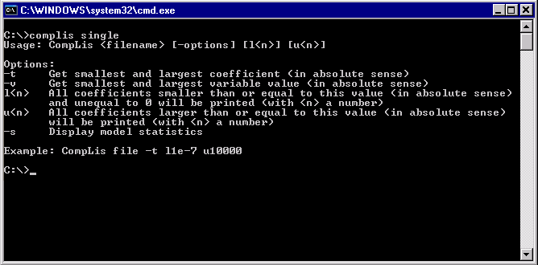

.. _Singlefilemode:
.. _CompLis_Singlefilemode:

Single file mode
================

**Description** 

CompLis can also be used for one listing file to get the following information:

*   the smallest and largest coefficients, or
*   the smallest and largest variable values, or
*   model statistics, e.g., the number of nonlinear variables and constraints.

**Usage** 

If you type 'complis single' at the command prompt you will see something similar to the picture below.

|img_def_cl3_bmp|

The text printed summarizes how CompLis should be used in single file mode and it gives a short description of the options that can be used. The argument 'filename' is obligatory. If you use a .lis file then you do not have the write the .lis extension; for other extensions you have to write the full name of the file.

The options that can be used for the optional argument '-options' are described in more detail in the Options (single file mode) section. The options 't' (getting smallest and largest coefficient), 'v' (getting smallest and largest variable value) and 's' (display model statistics) cannot be combined.

The optional arguments 'l' and 'u' can be used in combination with option 't' or 'v'. For example, '-t l1e-7 u10000' means that all coefficients smaller than 1e-7 and larger than 10000 (in absolute sense) will be printed.

**Learn more about** 

*	:ref:`CompLis_CompLis_Options`  

